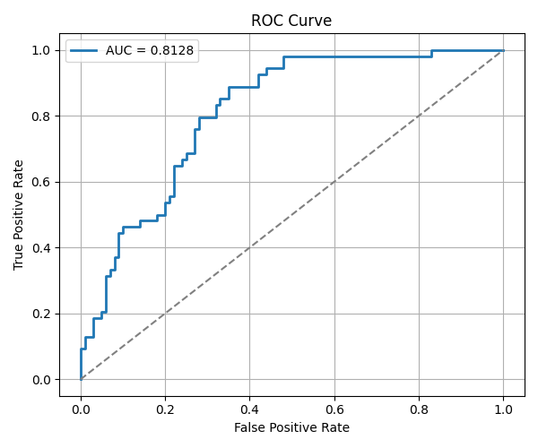

# Logistic Regression on Pima Indians Diabetes Dataset

## 📌 Project Overview
This project applies **Logistic Regression** to the **Pima Indians Diabetes Dataset** to predict whether a patient has diabetes based on medical attributes.  
The assignment covers data preprocessing, model training, evaluation, and visualization.  

---

## 📊 Dataset
- **Source:** [Pima Indians Diabetes Dataset](https://raw.githubusercontent.com/plotly/datasets/master/diabetes.csv)  
- **Samples:** 768  
- **Features:**  
  - Pregnancies  
  - Glucose  
  - Blood Pressure  
  - Skin Thickness  
  - Insulin  
  - BMI  
  - Diabetes Pedigree Function  
  - Age  
- **Target:** `Outcome` (0 = non-diabetic, 1 = diabetic)  

---

## ⚙️ Methodology
1. **Preprocessing**
   - Replaced invalid `0` values in `Glucose`, `BloodPressure`, `SkinThickness`, `Insulin`, and `BMI` with median values.  
   - Standardized features using `StandardScaler`.  

2. **Model Training**
   - Used **Logistic Regression** (`sklearn.linear_model.LogisticRegression`).  
   - Train-test split: **80-20 stratified**.  

3. **Evaluation**
   - Metrics: Accuracy, Precision, Recall, F1-score, ROC-AUC.  
   - Performed **5-fold Stratified Cross-Validation**.  

4. **Visualization**
   - **ROC Curve**  
   - **Confusion Matrix**  

---

## 🏆 Results
- **Test Set Performance**
  - Accuracy: **69.5%**  
  - Precision: **57.5%**  
  - Recall: **50.0%**  
  - F1-score: **53.5%**  
  - ROC AUC: **0.8128**  

- **Cross-validation (5-fold ROC AUC):**  
  `[0.8250, 0.8672, 0.8515, 0.8294, 0.8096]`  
  - **Mean AUC:** **0.8366**  

---

## 📈 Visualizations
### ROC Curve

### Confusion Matrix

---

